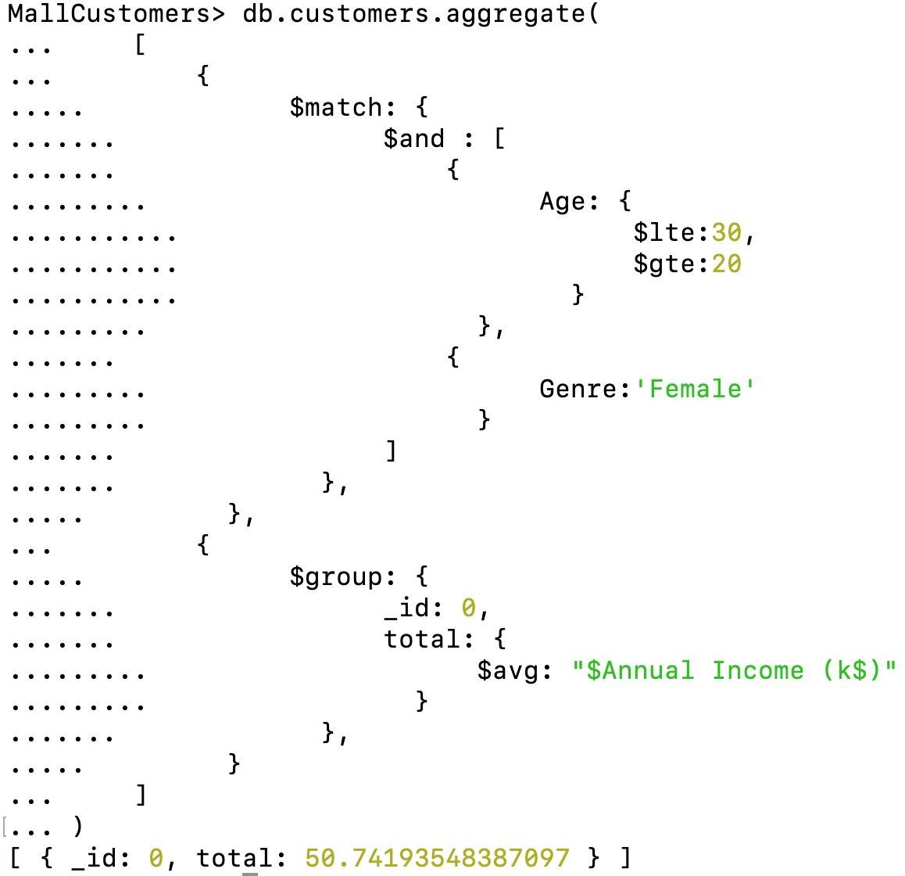
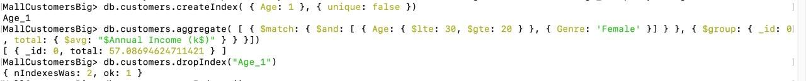

# 1. Установка mongodb и импорт csv-файла

## Установка

## Запуск

## Создание базы данных

## Импорт csv-файла

## Вывод первых пяти объектов
- 

# 2. Запросы на выборку и обновление данных

## Средний годовой доход женщин в возрасте от 20 до 30 лет

## Мужчины-пенсионеры, с объемом трат более 50%

## Увеличить на 1 год возраст всем клиентам

## Повторим предыдущую операцию, чтобы убедиться, что возраст действительно поменялся

## Уменьшить заработную плату клиента, имеющего 111 id, на 2 тысячи долларов в год

# 3. Индексы
## Чтобы протестировать индексы, cгенерируем датасет побольше с помощью нехитрой программы generator.cpp. Создадим новую базу, сделаем к ней парочку старых запросов.
 

## Очевидно, что при работе с нашей базой пригодятся уникальные индексы, а не разреженные, поскольку в датасете содержатся только размеченные данные. Создадим по отдельности два индекса (по возрасту и полу) и замерим время исполнения запроса, а затем создадим индекс, который будет включать себя все поля из нашего запроса.

## На основе физического измерения времени можно заметить, что наличие индекса по возрасту существенно ускорило время обработки запроса(в 6-7 раз), в то время как индекс по полу практически не внес вклада в скорость. Это легко можно объяснить тем, что пола всего два, их распределение примерно одинаково, соответственно, такая структура, как B-дерево, позволит лишь найти границу разделения мужского и женского пола, соответственно,  вместо полного перебора, нам придется перебрать лишь половину элементов, что также, в общем-то, много, поэтому выигрыш оказался несущественным, в отличие от первого индекса, который по сути дела сразу отсекает бо́льшую часть датасета(примерно 84 процента), и дальнейшая работа ведется внутри этого не очень большого подмножества, соответственно, перебор занимает примерно 1/6 от объема всего датасета. Третий же индекс показал себя чуть лучше, чем первый - это не удивительно, поскольку он фактически создан под наш запрос с целью максимально его оптимизировать (оптимизируются сразу два поля, соответственно профит от этого - произведение профитов обоих индексов, то есть запрос стал выполняться примерно в 12 раз быстрее).

# Результат работы:
- Скачана MongoDB, фактически создан с нуля большой датасет.
- Создано некоторое количество осмысленных запросов к ней, включая обновление уже существующих данных.
- Исследовано такое понятие, как индексы, произведен отбор и анализ использования различных индексов в конкретной задаче на конкретном запросе.
